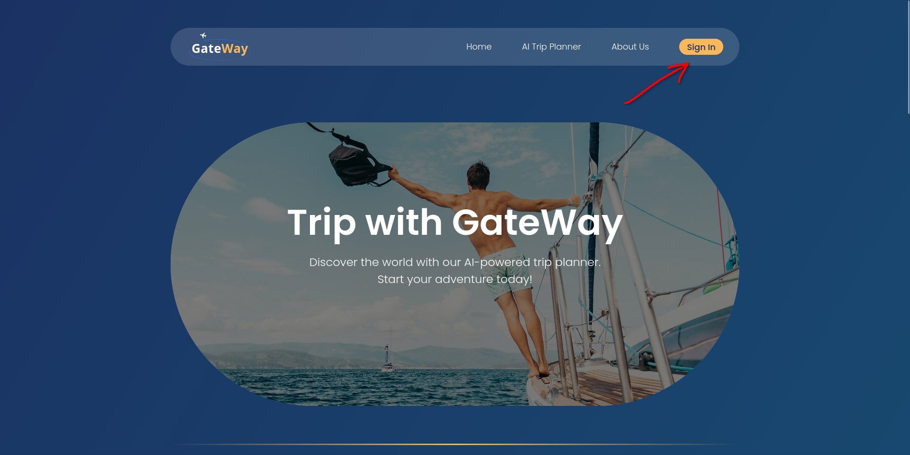
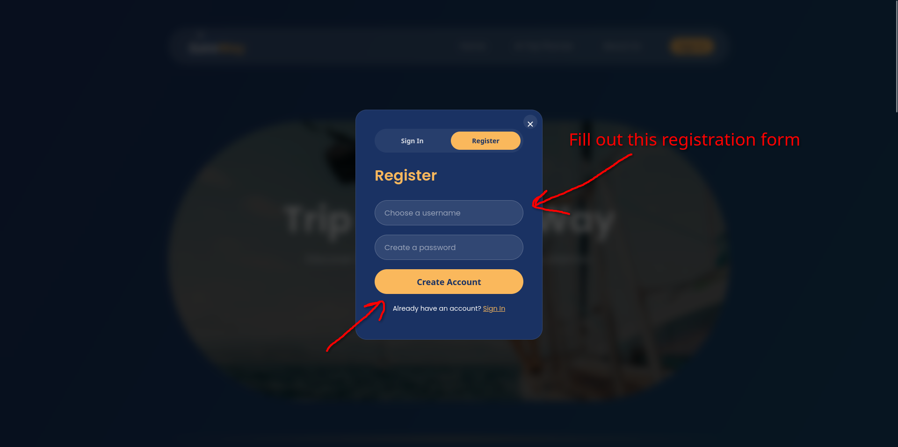
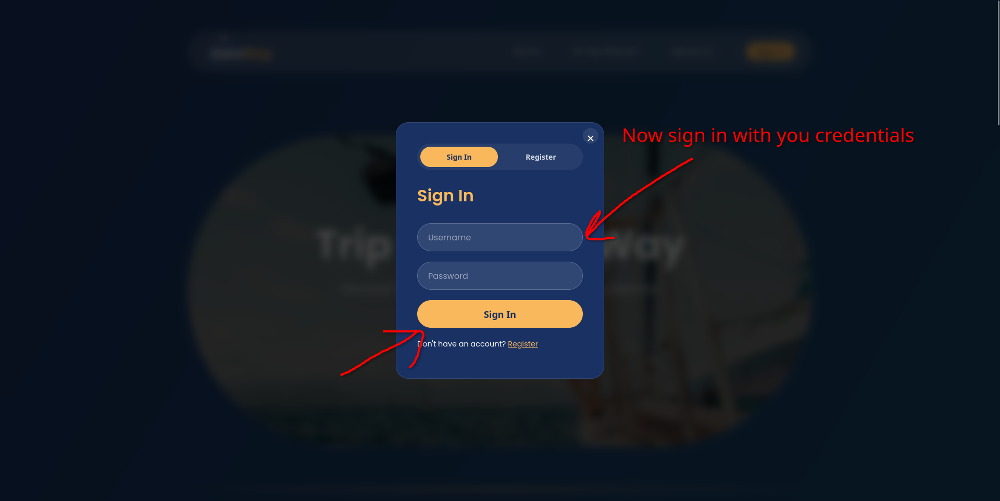
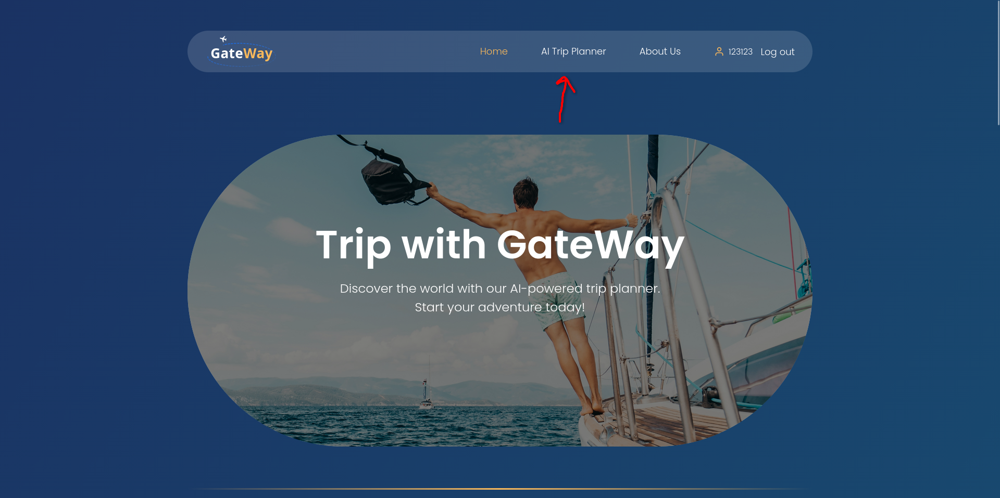
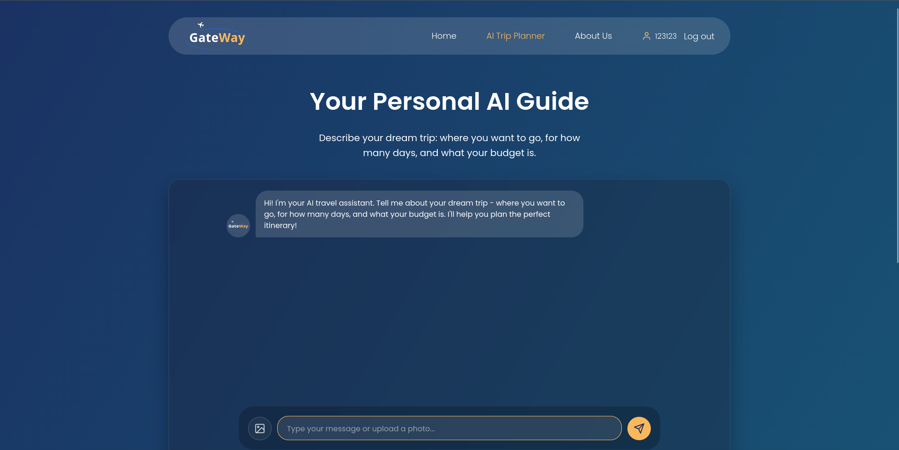
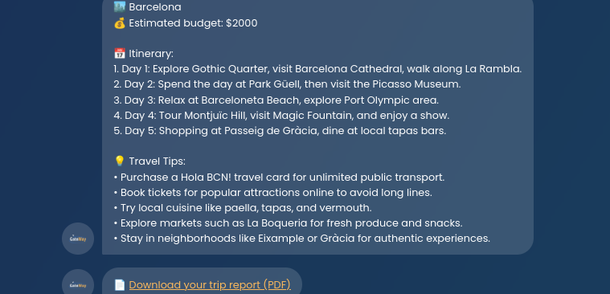

# GateWay ✈️

**GateWay** is an AI-powered travel planning web application. Users can upload a travel photo or describe a destination in text, and the app generates a personalized trip itinerary and budget estimate using AWS Bedrock. Results are saved to Azure SQL, and a PDF trip report is generated and stored in Azure Blob Storage.

---

## Table of Contents

- [Task Analysis](#task-analysis)
- [Technology Choices](#technology-choices)
- [Service Diagram](#service-diagram)
- [Team Contributions](#team-contributions)
- [Features](#features)
- [Tech Stack](#tech-stack)
- [Project Structure](#project-structure)
- [Prerequisites](#prerequisites)
- [Running with Docker](#running-with-docker)
- [API Reference](#api-reference)
- [Database Schema](#database-schema)
- [Authentication](#authentication)
- [How to Use the Application](#how-to-use-the-application)
- [Frontend](#frontend)

---

## Task Analysis

The goal of the project was to build a web application that allows users to plan travel with the help of artificial intelligence. A user can upload a photo of a location or enter a text description of a destination, and the system automatically generates a personalised travel itinerary, a budget estimate, and travel tips.

The task was divided into three main areas:

**1. Authentication and user management** — The system must support registration, login, and roles (`user` / `admin`). Admins have extended permissions to manage users and view their data.

**2. AI processing** — The core of the application is an integration with AWS Bedrock (Amazon Nova Lite model), which analyses images and/or text prompts and returns structured JSON data: the identified city, itinerary, estimated budget, and travel tips. The result is saved to the database and a PDF report is generated at the same time.

**3. Frontend and user interface** — The application must be accessible via a web browser as a single-page application (SPA). The user interacts with the system through a chat-like interface, can upload images, and views results directly in the browser.

An important requirement was containerisation of the entire solution using Docker, so that the application can be run on any environment without manual dependency configuration.

---

## Technology Choices

**FastAPI (Python)** — Chosen for the backend due to its high performance, automatic OpenAPI documentation generation (`/docs`), and native support for asynchronous operations. Pydantic schemas ensure input data validation.

**Azure SQL** — A relational database from Microsoft supporting MSSQL syntax. Used for persistent storage of users, trips, and chat history. The SQLAlchemy ORM provides a database-agnostic data access layer.

**Azure Blob Storage** — Object storage for uploaded images and generated PDF reports. Well suited for unstructured files that would be inefficient to store directly in a SQL database.

**AWS Bedrock (Amazon Nova Lite)** — A managed AI service from Amazon that provides access to multimodal language models without requiring own infrastructure. The Nova Lite model supports both image and text analysis and returns structured responses.

**JWT (HS256)** — Stateless authentication via JSON Web Tokens eliminates the need for server-side session storage and works well in a containerised environment.

**Nginx** — A lightweight web server used to serve the static frontend and as a reverse proxy to forward `/api` and `/ai` requests to the FastAPI backend.

**Docker / Docker Compose** — Containerisation guarantees a consistent environment in both development and production. Docker Compose orchestrates the frontend and backend as separate services with a single command.

**Vanilla JS (no framework)** — The frontend is implemented in plain JavaScript without a dependency on React or Vue, which reduces build complexity and bundle size for a relatively simple SPA.

---

## Service Diagram

```
┌─────────────────────────────────────────────────────────────────┐
│                          User (Browser)                          │
└──────────────────────────────┬──────────────────────────────────┘
                               │ HTTP :8080
                               ▼
                  ┌────────────────────────┐
                  │   Frontend (Nginx)      │
                  │   HTML / CSS / JS       │
                  │   port 8080             │
                  └───────────┬────────────┘
                              │ Reverse Proxy
                              │ /api/*  →  :8000
                              │ /ai/*   →  :8000
                              ▼
                  ┌────────────────────────┐
                  │   Backend (FastAPI)     │
                  │   Python 3.11          │
                  │   Gunicorn + Uvicorn   │
                  │   port 8000            │
                  └──┬──────────┬──────────┘
                     │          │          │
          ┌──────────┘    ┌─────┘    ┌─────┘
          ▼               ▼          ▼
┌──────────────┐  ┌──────────────┐  ┌──────────────────┐
│  Azure SQL   │  │ Azure Blob   │  │   AWS Bedrock     │
│  (MSSQL)     │  │  Storage     │  │  Nova Lite model  │
│              │  │              │  │  (AI inference)   │
│  users       │  │  images/     │  │                   │
│  trips       │  │  PDFs        │  │  eu-west-3        │
│  chat_msgs   │  │              │  │                   │
└──────────────┘  └──────────────┘  └──────────────────┘
```

**Data flow for an AI request:**
```
User uploads image / enters text
        │
        ▼
FastAPI /ai/process
        ├── upload_image_to_blob()   → stores image  → Azure Blob
        ├── call_nova_lite()         → AI analysis   → AWS Bedrock
        ├── upload_trip_report_pdf() → creates PDF   → Azure Blob
        └── save_trip_to_db()        → saves trip    → Azure SQL
        │
        ▼
Response: itinerary, budget, image URL, PDF URL
```

---

## Team Contributions

### Vladyslav Dovhyi — Frontend

Vladyslav was responsible for the entire frontend of the application. He designed and implemented the single-page application (SPA) in plain HTML, CSS, and Vanilla JavaScript. He built the navigation system between sections (Home, AI Trip Planner, About Us) without full page reloads. He implemented the authentication module `gateway_auth.js`, which manages JWT tokens in `localStorage`, displays the login/registration modal, and updates the UI after sign-in. He designed the chat-like interface for AI interaction, including image upload with preview. He ensured the AI Trip Planner section is accessible only to authenticated users, and implemented the admin UI for user management. He also configured Nginx as both the static file server and the reverse proxy to the backend.

### Danil Kozhan — Backend & Database

Danil was responsible for the design and implementation of the backend. He built the FastAPI application with all routers — authentication, trip management, chat history, and health-check endpoints. He defined the SQLAlchemy ORM models (`User`, `Trip`, `ChatMessage`) and Pydantic schemas for input and output validation. He implemented JWT authentication with roles (`user` / `admin`), including bcrypt password hashing and the `get_current_user` and `require_admin` dependency functions. He designed the database schema and wrote the initialisation SQL script. He ensured proper error handling and transaction rollback on database failure.

### Andrii Denysenko — AI Integration & Cloud Infrastructure

Andrii was responsible for cloud service integration and the AI pipeline. He implemented communication with AWS Bedrock (Amazon Nova Lite model) for multimodal image and text analysis, including parsing of the structured JSON response containing city, itinerary, budget, and tips. He implemented the upload of images and generated PDF reports to Azure Blob Storage. He configured Docker and Docker Compose to orchestrate both services (frontend and backend) and prepared `config.py` with management of all environment variables using a `dataclass`. He was also responsible for deploying and testing the complete solution in the cloud environment.

---


## Features

- **AI Trip Planner** – Upload a travel image or enter a text prompt to receive a full itinerary, budget estimate, and travel tips powered by AWS Bedrock (Amazon Nova Lite).
- **PDF Report Generation** – Automatically generates and stores a downloadable PDF trip report in Azure Blob Storage.
- **JWT Authentication** – Secure registration and login with role-based access (`user` / `admin`).
- **Chat History** – Persistent per-user chat history stored in Azure SQL.
- **Trip Management** – Save, view, and delete AI-generated or manually created trips.
- **Admin Panel** – Admin users can list all users, view any user's trips/chat history, change roles, and delete accounts.
- **Single-Page Application** – Vanilla JS frontend served via Nginx.

---

## Tech Stack

| Layer | Technology |
|---|---|
| Backend | Python 3.11, FastAPI, Uvicorn, Gunicorn |
| Database | Azure SQL (via SQLAlchemy + pyodbc / MSSQL) |
| AI | AWS Bedrock – Amazon Nova Lite (`eu.amazon.nova-2-lite-v1:0`) |
| File Storage | Azure Blob Storage |
| Auth | JWT (HS256) via `python-jose`, passwords hashed with `bcrypt` |
| Frontend | HTML5, CSS3, Vanilla JS, served by Nginx |
| Containerisation | Docker, Docker Compose |

---

## Project Structure

```
GateWay/
├── backend_fastapi/
│   ├── app/
│   │   ├── main.py           # FastAPI app entry point, middleware, startup
│   │   ├── config.py         # Settings loaded from environment variables
│   │   ├── database.py       # SQLAlchemy engine and session
│   │   ├── models.py         # ORM models: User, Trip, ChatMessage
│   │   ├── schemas.py        # Pydantic request/response schemas
│   │   ├── auth.py           # JWT creation and dependency helpers
│   │   ├── services.py       # Bedrock inference, Blob upload, PDF generation
│   │   └── routers/
│   │       ├── auth.py       # /api/register, /api/login, /api/me, /api/users
│   │       ├── trips.py      # /trips CRUD
│   │       ├── ai.py         # /ai/process – image/text → AI → trip + PDF
│   │       ├── chat.py       # /api/chat/history, /api/chat/message
│   │       └── blob.py       # /blob/health, /blob/upload-test
│   ├── Dockerfile
│   └── requirements.txt
├── frontend/
│   ├── index.html            # Main SPA shell
│   ├── script.js             # Page routing, chat UI, image upload
│   ├── gateway_auth.js       # Auth modal, token management, profile UI
│   ├── nginx.conf            # Nginx config (proxy /api and /ai to backend)
│   └── styles/
│       └── pictures/         # Static images used in the UI
├── db-init/
│   └── gateway_init_clean.sql  # Optional SQL init script
├── docker-compose.yml
├── Dockerfile                # Root Dockerfile (builds backend image)
└── .gitignore
```

---

## Prerequisites

- [Docker](https://docs.docker.com/get-docker/) and [Docker Compose](https://docs.docker.com/compose/)
- An **Azure SQL** database (connection string)
- An **Azure Blob Storage** account (connection string + container name)
- An **AWS** account with **Bedrock** access enabled in `eu-west-3` (or your chosen region)

---

## Running with Docker

```bash
# 1. Clone the repository
git clone <repo-url>
cd GateWay

# 2. Create your .env file with the required credentials
#    (Azure SQL, Azure Blob, AWS Bedrock, JWT secret)

# 3. Build and start all services
docker compose up --build

# Backend available at:  http://localhost:8000
# Frontend available at: http://localhost:8080
# Interactive API docs:  http://localhost:8000/docs
```

To stop:
```bash
docker compose down
```

---

## API Reference

All protected endpoints require the header:
```
Authorization: Bearer <jwt_token>
```

### Auth — `/api`

| Method | Path | Auth | Description |
|---|---|---|---|
| `POST` | `/api/register` | Public | Register a new user |
| `POST` | `/api/login` | Public | Login and receive a JWT |
| `GET` | `/api/me` | User | Get current user profile |
| `PUT` | `/api/me` | User | Update username or password |
| `DELETE` | `/api/me` | User | Delete own account |
| `GET` | `/api/users` | Admin | List all users |
| `GET` | `/api/users/{id}` | User/Admin | Get a user by ID |
| `PUT` | `/api/users/{id}/role` | Admin | Change a user's role |
| `DELETE` | `/api/users/{id}` | Admin | Delete a user |

### AI — `/ai`

| Method | Path | Auth | Description |
|---|---|---|---|
| `POST` | `/ai/process` | User | Submit image and/or text prompt; returns itinerary, budget, PDF URL, and saved trip |

Request: `multipart/form-data` with optional `image` (file) and `prompt`/`text` (string) fields.

### Trips — `/trips`

| Method | Path | Auth | Description |
|---|---|---|---|
| `GET` | `/trips` | User | List own trips |
| `GET` | `/trips/{id}` | User/Admin | Get a trip by ID |
| `POST` | `/trips` | User | Manually create a trip |
| `DELETE` | `/trips/{id}` | User/Admin | Delete a trip |
| `GET` | `/trips/user/{user_id}` | Admin | List trips for a specific user |

### Chat — `/api/chat`

| Method | Path | Auth | Description |
|---|---|---|---|
| `GET` | `/api/chat/history` | User | Get own chat history (last 100 messages) |
| `POST` | `/api/chat/message` | User | Save a chat message (`user` or `assistant` role) |
| `DELETE` | `/api/chat/history` | User | Clear own chat history |
| `GET` | `/api/chat/history/{user_id}` | Admin | Get a user's full chat history |

### Health

| Method | Path | Description |
|---|---|---|
| `GET` | `/` | Service info |
| `GET` | `/health` | Health check |
| `GET` | `/blob/health` | Azure Blob connectivity check |
| `GET` | `/db/health` | Azure SQL connectivity check |

---

## Database Schema

The schema is auto-created on startup by SQLAlchemy. The `db-init/gateway_init_clean.sql` file provides a reference SQL script.

**users**
| Column | Type | Notes |
|---|---|---|
| `id` | int (PK) | Auto-increment |
| `email` | varchar(255) | Used as the login username, unique |
| `username` | varchar(255) | Display name |
| `password_hash` | varchar(255) | bcrypt hash |
| `role` | varchar(32) | `user` or `admin` |

**trips**
| Column | Type | Notes |
|---|---|---|
| `id` | int (PK) | Auto-increment |
| `user_id` | int (FK → users) | |
| `detected_city` | varchar(255) | City identified by AI |
| `image_url` | varchar(1024) | Azure Blob URL of the uploaded image |
| `itinerary` | text | JSON-serialised itinerary array |
| `budget_estimate` | numeric(12,2) | Estimated trip cost |

**chat_messages**
| Column | Type | Notes |
|---|---|---|
| `id` | int (PK) | Auto-increment |
| `user_id` | int (FK → users) | |
| `role` | varchar(32) | `user` or `assistant` |
| `message` | text | Message content |
| `created_at` | datetime | Server-generated timestamp |

---

## How to Use the Application

This section walks through the full user flow from first visit to receiving a generated trip plan.

---

### Step 1 — Open the app and click Sign In

You will see the GateWay home page. Click the **Sign In** button in the top-right corner of the navigation bar.



---

### Step 2 — Create an account

The authentication modal opens on the **Register** tab by default. Enter a username and a password, then click **Create Account**. If you already have an account, click the *Sign In* link at the bottom of the modal to switch tabs.



---

### Step 3 — Sign in with your credentials

Switch to the **Sign In** tab, enter your username and password, and click **Sign In**.



---

### Step 4 — You are now logged in

After a successful login the modal closes and the navigation bar updates to show your username and a **Log out** button. The **Sign In** button is replaced by your account info.



---

### Step 5 — Open the AI Trip Planner

Click **AI Trip Planner** in the navigation bar. You will land on the personal AI guide page where the assistant greets you and asks you to describe your dream trip — destination, number of days, and budget.



---

### Step 6 — Describe your trip

Type your request in the chat input at the bottom of the screen and press the send button (or hit Enter). You can also click the image icon to upload a travel photo instead of or alongside your text prompt.

**Example input:** `5-day trip to Barcelona, $2000 budget`


---

### Step 7 — Receive your itinerary and download the PDF

The AI returns a structured response that includes the detected city, estimated budget, a day-by-day itinerary, and practical travel tips. Below the response you will find a **Download your trip report (PDF)** link — click it to download a complete, formatted PDF version of your trip plan.



---

## Authentication

- Passwords are hashed with **bcrypt** before storage.
- On login, a signed **HS256 JWT** is issued containing `user_id`, `username`, and `role`.
- Token expiry defaults to **1 hour** and is configurable via `JWT_EXPIRE_HOURS`.
- The frontend stores the token in `localStorage` under the key `gateway_jwt` and attaches it as a `Bearer` token on every API request.
- Admin-only endpoints use a `require_admin` dependency that rejects non-admin JWTs with `403 Forbidden`.

---

## Frontend

The frontend is a single-page application served by **Nginx** on port `8080`. Nginx also acts as a reverse proxy, forwarding `/api` and `/ai` requests to the FastAPI backend at port `8000`.

Key pages:
- **Home** – Landing page with hero section and feature highlights.
- **AI Trip Planner** – Chat-style interface for uploading photos or entering text prompts. Requires authentication.
- **About Us** – Project information.

Authentication flow:
- Unauthenticated users are shown a modal when they try to access the AI planner.
- After login, the UI updates to show the username, profile dropdown, and logout option.
- Admin users see additional management options in the profile menu.
